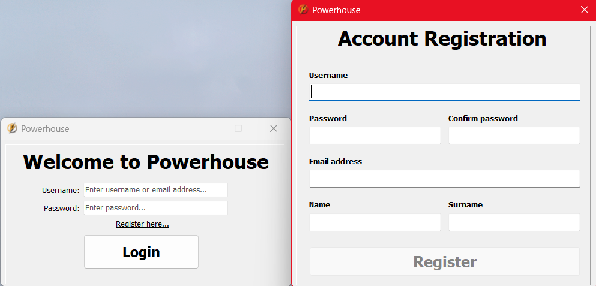
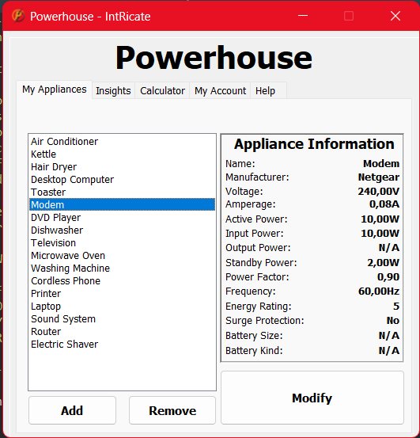
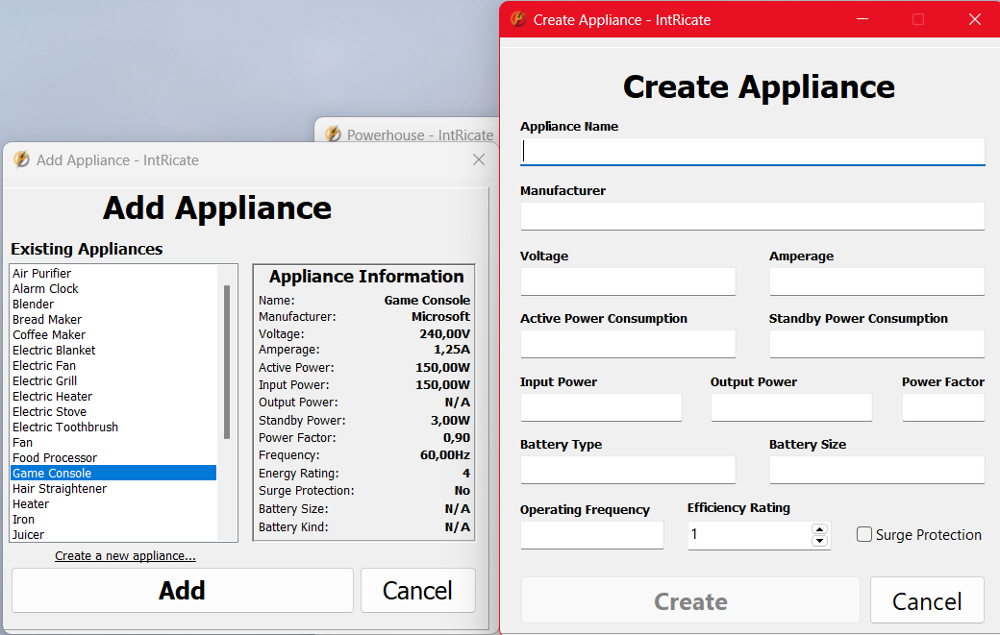
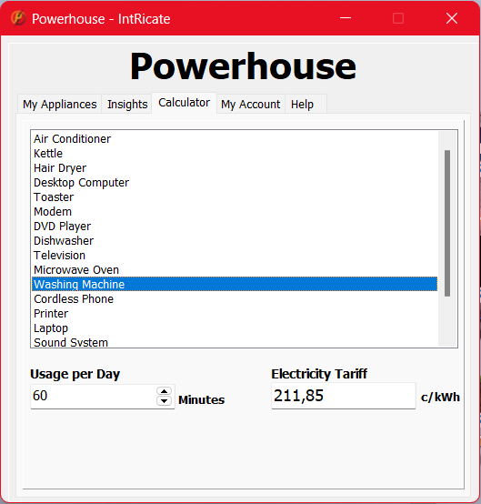

# Powerhouse
---


## Scenario
The load shedding epidemic in South Africa has flung the country into a full-scale energy crisis, and the average person is being greatly affected by it. The government has been encouraging people to conserve electricity, which is not an easy task since almost all of our appliances and devices require electricity to operate properly. This crisis has highlighted the need for individuals to be more mindful of their energy usage to reduce their impact on the environment and save money on their electricity bills. However, many people lack the tools and knowledge to accurately track their energy consumption and identify areas where they can make changes to reduce their energy usage.

The solution to this problem is Powerhouse. Powerhouse is an electricity calculator application that allows users to input the type of appliance they are using and the amount of time they are using it to accurately calculate their energy consumption and cost and provide them with a deeper understanding of how their electricity costs work. The application will also provide users with tips and tricks for conserving energy and reducing their carbon footprint. By helping users to track their energy usage and providing them with the knowledge and resources to make informed decisions about their energy consumption, Powerhouse aims to empower individuals to reduce their impact on the environment, save money on their electricity bills, and minimize the potential damage caused to their appliances as a result of load shedding.

## User Requirements
The Powerhouse application will primarily target homeowners. The average homeowner in South Africa cannot afford to install solar panels or purchase inverters. Therefore, Powerhouse will cater to these individuals by helping them to save money on electricity and prolong the lifespan of their appliances as much as possible. Homeowners should know how much power their electrical appliances use, the implications of using these appliances for prolonged periods, and how to reduce their electrical expenses.

During the development of Powerhouse, I interviewed several individuals to determine what features they would like in an application of this nature. The responses I received included:
-	"I want to be able to set a budget for my energy usage so that I can stay within my financial means."
-	"As a user, I want to receive tips and tricks for conserving energy so that I can reduce my carbon footprint and save money on my electricity bill."
-	"I would like to learn more about how my electrical appliances work and the dos and don'ts of 
-	operating these appliances during load shedding.”

## Gallery






## License
Powerhouse is licensed under the MIT License. See [LICENSE](LICENSE)

```
MIT License

Copyright (c) 2023 Adam Foflonker

Permission is hereby granted, free of charge, to any person obtaining a copy
of this software and associated documentation files (the "Software"), to deal
in the Software without restriction, including without limitation the rights
to use, copy, modify, merge, publish, distribute, sublicense, and/or sell
copies of the Software, and to permit persons to whom the Software is
furnished to do so, subject to the following conditions:

The above copyright notice and this permission notice shall be included in all
copies or substantial portions of the Software.

THE SOFTWARE IS PROVIDED "AS IS", WITHOUT WARRANTY OF ANY KIND, EXPRESS OR
IMPLIED, INCLUDING BUT NOT LIMITED TO THE WARRANTIES OF MERCHANTABILITY,
FITNESS FOR A PARTICULAR PURPOSE AND NONINFRINGEMENT. IN NO EVENT SHALL THE
AUTHORS OR COPYRIGHT HOLDERS BE LIABLE FOR ANY CLAIM, DAMAGES OR OTHER
LIABILITY, WHETHER IN AN ACTION OF CONTRACT, TORT OR OTHERWISE, ARISING FROM,
OUT OF OR IN CONNECTION WITH THE SOFTWARE OR THE USE OR OTHER DEALINGS IN THE
SOFTWARE.
```